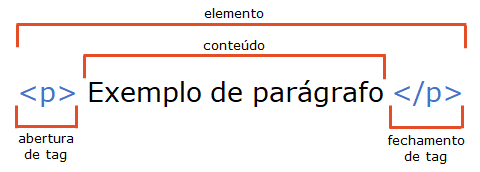
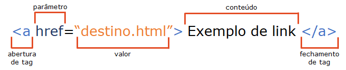
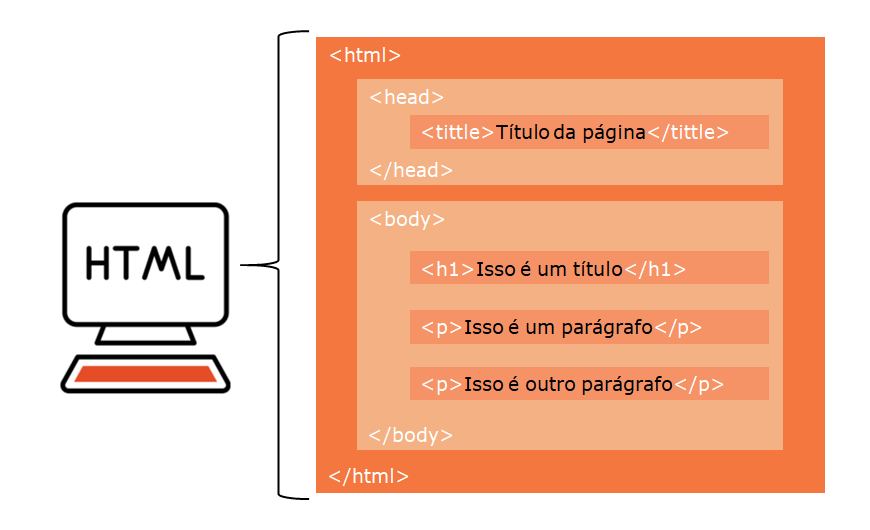
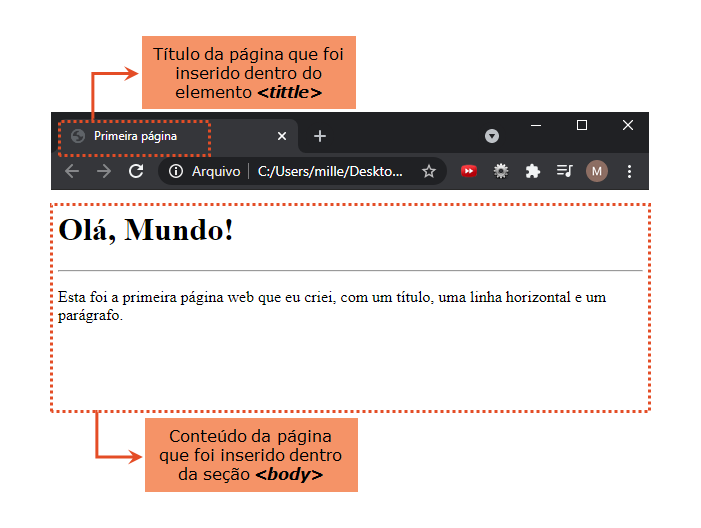
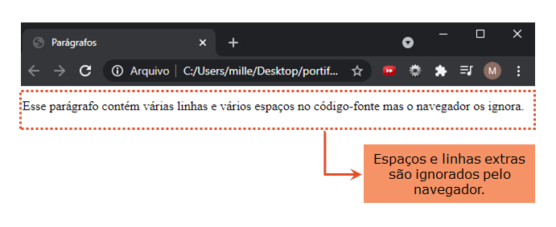
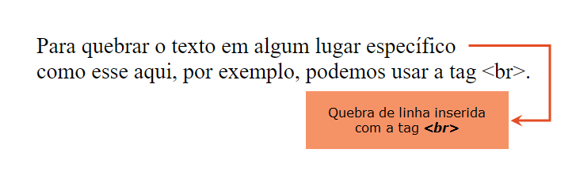
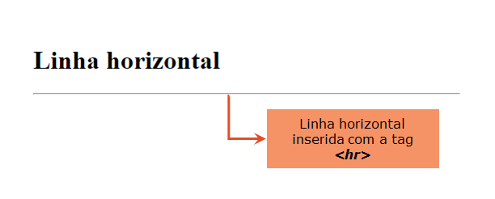
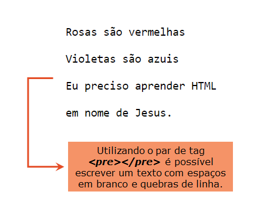

<h2 align = "justify"> Este repositório é um compilado do conhecimento que estou adquirindo ao estudar HTML. Ele contém minhas anotações pessoais, exercícios, insights e resumos sobre HTML e serve como um guia para auxiliar e direcionar os meus estudos! &#x1F4DA </h2> <hr>

PRINCIPAIS GUIAS E REFERÊNCIAS: 

* HTML5 e CSS3 do Curso em Vídeo 
* HTML Web Developer da Digital Innovation One
* Avanade Angular Developer da Digital Innovation One

# ÍNDICE 

- [INTRODUÇÃO](#introduction)
- [TEXTO](#text)

<hr>


<h1> <a name = "introduction"></a>INTRODUÇÃO</h1>

<p align = "justify">HTML (HyperText Markup Language ou Linguagem de Marcação de HiperTexto) é uma linguagem de marcação usada para criar páginas web. É o bloco de construção mais básico da web que define o significado e a estrutura do conteúdo da página. Elementos HTML são empregados para descrever a <strong>estrutura</strong> da página, informando ao navegador como exibir o <strong>conteúdo</strong>. Esses elementos identificam partes do conteúdo como "título", "parágrafo", "link" etc.</p>

<p align = "justify"> O conteúdo de uma página web é criado em HTML. A organização e o visual desse conteúdo, posição dos componentes, cores dos textos e tudo mais é definido em CSS (Cascading Style Sheets ou Folhas de Estilo em Cascata). O menu de navegação e as interações em geral da página, por sua vez, são desenvolvidos em JavaScript.</p>


## ELEMENTOS HTML

<p align = "justify"> Os elementos são definidos por uma tag (marcação) de abertura, algum conteúdo, e uma tag de fechamento.  As tags agem como containers, dizendo algo sobre as informações que estão entre suas tags de abertura e fechamento (DUCKETT, 2011). </p>



> <strong>Observação:</strong> alguns elementos HTML não têm conteúdo. Eles são chamados de elementos vazios e não   	possuem tag de fechamento.

### Atributos dos Elementos HTML

<p align = "justify">Os elementos HTML podem ter atributos, que irão fornecer informações adicionais sobre eles. Esses atributos são sempre especificados na tag de abertura e, geralmente, vêm em pares de nome/valor: <strong>nome = "valor"</strong>. </p>



## ESTRUTURA DA PÁGINA HTML

Uma página HTML possui a seguinte estrutura:



Código básico de um documento HTML:

```html
<!DOCTYPE html>
<html lang="pt-br">
<head>
    <meta charset="UTF-8">
    <meta http-equiv="X-UA-Compatible" content="IE=edge">
    <meta name="viewport" content="width=device-width, initial-scale=1.0">
    <title>Document</title>
</head>
<body>
    
</body>
</html>
```

<ol align = "justify">
    <li> <code>!DOCTYPE html</code>: define que é um documento HTML5. </li> 
    <li> <code>html</code>: é o "elemento raiz" de uma página HTML e envolve o conteúdo da página inteira (aqui, estamos indicando também que o conteúdo da página será no idioma Português do Brasil).</li>
    <li> <code>head</code>: é o elemento que contém meta informações sobre a página HTML, ele atua como container para todo o conteúdo da página que não é visível para o usuário.</li>
    <li> <code>meta charset="UTF-8"</code>:é o elemento define o tipo da codificação dos caracteres que o documento deve usar, neste caso, para o tipo UTF-8, que inclui a maioria dos caracteres das línguas humanas escritas. </li>
    <li> <code>meta name="viewport" content="width=device-width, initial-scale=1.0"</code>: indica que o conteúdo aparecerá, por padrão, ocupando todo o espaço disponível da tela e com uma escala de 1:1.</li>
    <li> <code>tittle</code>: é o elemento que especifica um título para a página HTML (mostrado na barra de título do navegador ou na guia da página).</li>
    <li> <code>body</code>: é o elemento que vai definir o corpo do documento. É um container para todo o conteúdo visível, como títulos, parágrafos, imagens, hiperlinks, tabelas, listas, etc. </li>
</ol>


## CRIANDO MINHA PRIMEIRA PÁGINA

Seguindo a estrutura básica do documento HTML, mostrado acima, podemos criar a nossa primeira página web:



<strong>VER CÓDIGO:</strong> [arquivo do código da minha primeira página web](https://github.com/millenevprado/html-my-notes/blob/main/exemplos/index.html)

<hr>

<h1> <a name = "text"></a>TEXTO</h1>

<p align = "justify"> Como vimos, para criar páginas web, nós adicionamos tags (marcação) ao conteúdo da página. Essas tags fornecem significado extra e permitem que os navegadores mostrem aos usuários a estrutura apropriada para a página. Existem dois tipos de marcação: 
<ul align = "justify">
    <li>marcação estrutural: elementos utilizados para descrever títulos e parágrafos dos textos (foco na forma);</li>
    <li>marcação semântica: fornece informações extras, como onde a ênfase é colocada em uma frase, que algo que você escreveu é uma citação, o significado das siglas, etc. (foco no significado) (DUCKET, 2011).</li>
</ul></p>

> A maior mudança do HTML4 para o HTML5 foi o acréscimo da semântica aos elementos!

## TÍTULOS (<em>HEADINGS</em>)

<p align = "justify"> Títulos em HTML (conhecidos como <em>headings</em>) possuem <strong>SEIS NÍVEIS</strong> de hierarquia que são definidos com as tags &lt;h1&gt; a &lt;h6&gt;.  Um &lt;h1&gt; significa que esse é um assunto principal, &lt;h2&gt; é um sub-assunto do &lt;h1&gt; e assim sucessivamente.</p>

```html
<h1>TÍTULO PRINCIPAL</h1>
<h2>TÍTULO NÍVEL 2</h2>
<h3>TÍTULO NÍVEL 3</h3>
<h4>TÍTULO NÍVEL 4</h4>
<h5>TÍTULO NÍVEL 5</h5>
<h6>TÍTULO NÍVEL 6</h6>
```

<strong>VER CÓDIGO:</strong> [código com exemplo empregando títulos](https://github.com/millenevprado/html-my-notes/blob/main/exemplos/titulos.html)

## PARÁGRAFOS

<p align = "justify">Para criar um parágrafo, basta colocar o conteúdo dentro da tag &lt;p&gt;&lt;/p&gt;. Um parágrafo sempre começa em uma nova linha. Com HTML, você não pode alterar a exibição adicionando espaços extras ou linhas extras em seu código HTML. O navegador removerá automaticamente quaisquer espaços e linhas extras quando a página for exibida. Por exemplo: </p>

```html
<p>
    Esse parágrafo
    contém várias linhas
    e    vários espaços
    no      código-fonte
    mas o navegador os
    ignora. 
</p>
```



### Inserindo quebra de linha

<p align = "justify">Para  quebrar uma linha (criar uma nova linha), sem começar um novo parágrafo, podemos usar a tag &lt;br&gt; , que é uma tag vazia, ou seja, não tem tag de fechamento. A tag &lt;br&gt; significa literalmente "quebre a linha" (break row). Por exemplo: </p>

```html
<p>
    Para quebrar o texto em algum lugar específico <br> 
    como esse aqui, por exemplo, podemos usar a tag &lt;br&gt;.
</p>
```



### Inserindo uma linha horizontal

<p align = "justify">Podemos também usar a tag &lt;hr&gt; para definir uma quebra temática em uma página HTML, que exibe uma linha horizontal: 



### Mantendo a formatação do texto

<p align = "justify">E se, por exemplo, eu quisesse escrever um poema, com espaços em branco e quebras de linhas, como proceder nesse caso? É simples, podemos utilizar, o elemento &lt;pre&gt;  que define o texto pré-formatado. Por exemplo: </p>


```html
<pre>
    Rosas são vermelhas
    
    Violetas são azuis
    
    Eu preciso aprender HTML
    
    em nome de Jesus.
</pre>
```



<strong>VER CÓDIGO:</strong> [código com exemplos de parágrafos, quebra de linha, linha horizontal e texto pré-formatado](https://github.com/millenevprado/html-my-notes/blob/main/exemplos/paragrafos.html)

