<h2 align = "justify"> Este repositório é um compilado do conhecimento que estou adquirindo ao estudar HTML. Ele contém minhas anotações pessoais, exercícios, insights e resumos sobre HTML e serve como um guia para auxiliar e direcionar os meus estudos! &#x1F4DA </h2>

<h4 align = "justify">CURSOS QUE ESTOU FAZENDO/FIZ E QUE SERVEM DE BASE PARA O DESENVOLVIMENTO DESSE COMPILADO: </h4> 

* [CS50's Introduction to Computer Science - Harvard University](https://online-learning.harvard.edu/course/cs50-introduction-computer-science?delta=0)
* [CS50's Web Programming with Python and JavaScript - Harvard University](https://online-learning.harvard.edu/course/cs50s-web-programming-python-and-javascript?delta=0)
* [HTML5 e CSS3 - Curso em Vídeo](https://www.cursoemvideo.com/course/html5-css3-modulo1/) 
* [HTML Web Developer - Digital Innovation One](https://digitalinnovation.one/)
* [Avanade Angular Developer - Digital Innovation One](https://digitalinnovation.one/)


> OBSERVAÇÃO: algumas partes deste material foram traduzidas diretamente do Tutorial HTML da [w3schools.com](https://www.w3schools.com/html/default.asp). As referências completas estão disponíveis [aqui](#references).


# ÍNDICE 

- [INTRODUÇÃO](#introduction)
- [TEXTO](#text)
- [LISTAS](#lists)
- [LINKS](#links)
- [IMAGENS](#images)
- [TABELAS](#tables)
- [FORMULÁRIOS](#forms)

<hr>


<h1> <a name = "introduction"></a>INTRODUÇÃO</h1>

<p align = "justify">HTML (HyperText Markup Language ou Linguagem de Marcação de HiperTexto) é uma linguagem de marcação usada para criar páginas web. É o bloco de construção mais básico da web que define o significado e a estrutura do conteúdo da página. Elementos HTML são empregados para descrever a <strong>estrutura</strong> da página, informando ao navegador como exibir o <strong>conteúdo</strong>. Esses elementos identificam partes do conteúdo como "título", "parágrafo", "link" etc.</p>

<p align = "justify"> O conteúdo de uma página web é criado em HTML. A organização e o visual desse conteúdo, posição dos componentes, cores dos textos e tudo mais é definido em CSS (Cascading Style Sheets ou Folhas de Estilo em Cascata). O menu de navegação e as interações em geral da página, por sua vez, são desenvolvidos em JavaScript.</p>


## ELEMENTOS HTML

<p align = "justify"> Os elementos são definidos por uma tag (marcação) de abertura, algum conteúdo, e uma tag de fechamento.  As tags agem como containers, dizendo algo sobre as informações que estão entre suas tags de abertura e fechamento (DUCKETT, 2011). </p>


> <strong>OBSERVAÇÃO:</strong> alguns elementos HTML não têm conteúdo. Eles são chamados de elementos vazios e não   possuem tag de fechamento.

### Atributos dos Elementos HTML

<p align = "justify">Os elementos HTML podem ter atributos, que irão fornecer informações adicionais sobre eles. Esses atributos são sempre especificados na tag de abertura e, geralmente, vêm em pares de nome/valor: <strong>nome = "valor"</strong>. </p>


## ESTRUTURA DA PÁGINA HTML

Uma página HTML possui a seguinte estrutura:


Código básico de um documento HTML:

```html
<!DOCTYPE html>
<html lang="pt-br">
<head>
    <meta charset="UTF-8">
    <meta http-equiv="X-UA-Compatible" content="IE=edge">
    <meta name="viewport" content="width=device-width, initial-scale=1.0">
    <title>Document</title>
</head>
<body>
    
</body>
</html>
```

<ol align = "justify">
    <li> <code>!DOCTYPE html</code>: define que é um documento HTML5. </li> 
    <li> <code>html</code>: é o "elemento raiz" de uma página HTML e envolve o conteúdo da página inteira (aqui, estamos indicando também que o conteúdo da página será no idioma Português do Brasil).</li>
    <li> <code>head</code>: é o elemento que contém meta informações sobre a página HTML, ele atua como container para todo o conteúdo da página que não é visível para o usuário.</li>
    <li> <code>meta charset="UTF-8"</code>:é o elemento define o tipo da codificação dos caracteres que o documento deve usar, neste caso, para o tipo UTF-8, que inclui a maioria dos caracteres das línguas humanas escritas. </li>
    <li> <code>meta name="viewport" content="width=device-width, initial-scale=1.0"</code>: indica que o conteúdo aparecerá, por padrão, ocupando todo o espaço disponível da tela e com uma escala de 1:1.</li>
    <li> <code>tittle</code>: é o elemento que especifica um título para a página HTML (mostrado na barra de título do navegador ou na guia da página).</li>
    <li> <code>body</code>: é o elemento que vai definir o corpo do documento. É um container para todo o conteúdo visível, como títulos, parágrafos, imagens, hiperlinks, tabelas, listas, etc. </li>
</ol>


## CRIANDO MINHA PRIMEIRA PÁGINA

Seguindo a estrutura básica do documento HTML, mostrado acima, podemos criar a nossa primeira página web:


<strong>VER CÓDIGO:</strong> [minha primeira página web](https://github.com/millenevprado/html-my-notes/blob/main/exemplos/index.html).

<hr>

<h1> <a name = "text"></a>TEXTO</h1>

<p align = "justify"> Como vimos, para criar páginas web, nós adicionamos tags (marcação) ao conteúdo da página. Essas tags fornecem significado extra e permitem que os navegadores mostrem aos usuários a estrutura apropriada para a página. Existem dois tipos de marcação: 
<ul align = "justify">
    <li>marcação estrutural: elementos utilizados para descrever títulos e parágrafos dos textos (foco na forma);</li>
    <li>marcação semântica: fornece informações extras, como onde a ênfase é colocada em uma frase, que algo que você escreveu é uma citação, o significado das siglas, etc. (foco no significado) (DUCKET, 2011).</li>
</ul></p>

> A maior mudança do HTML4 para o HTML5 foi o acréscimo da semântica aos elementos!

## TÍTULOS (<em>HEADINGS</em>)

<p align = "justify"> Títulos em HTML (conhecidos como <em>headings</em>) possuem <strong>SEIS NÍVEIS</strong> de hierarquia que são definidos com as tags &lt;h1&gt; a &lt;h6&gt;.  Um &lt;h1&gt; significa que esse é um assunto principal, &lt;h2&gt; é um sub-assunto do &lt;h1&gt; e assim sucessivamente.</p>

```html
<h1>TÍTULO PRINCIPAL</h1>
<h2>TÍTULO NÍVEL 2</h2>
<h3>TÍTULO NÍVEL 3</h3>
<h4>TÍTULO NÍVEL 4</h4>
<h5>TÍTULO NÍVEL 5</h5>
<h6>TÍTULO NÍVEL 6</h6>
```

<strong>VER CÓDIGO:</strong> [exemplo empregando títulos](https://github.com/millenevprado/html-my-notes/blob/main/exemplos/titulos.html).

## PARÁGRAFOS

<p align = "justify">Para criar um parágrafo, basta colocar o conteúdo dentro da tag &lt;p&gt;&lt;/p&gt;. Um parágrafo sempre começa em uma nova linha. Com HTML, você não pode alterar a exibição adicionando espaços extras ou linhas extras em seu código HTML. O navegador removerá automaticamente quaisquer espaços e linhas extras quando a página for exibida. Por exemplo: </p>

```html
<p>
    Esse parágrafo
    contém várias linhas
    e    vários espaços
    no      código-fonte
    mas o navegador os
    ignora. 
</p>
```


### Inserindo quebra de linha

<p align = "justify">Para  quebrar uma linha (criar uma nova linha), sem começar um novo parágrafo, podemos usar a tag &lt;br&gt;, que é uma tag vazia, ou seja, não tem tag de fechamento. A tag &lt;br&gt; significa literalmente "quebre a linha" (break row). Por exemplo: </p>

```html
<p>
    Para quebrar o texto em algum lugar específico <br> 
    como esse aqui, por exemplo, podemos usar a tag &lt;br&gt;.
</p>
```


> <strong>OBSERVAÇÃO:</strong>  &lt e &gt são usados no código acima para representar os caracteres (<) e (>) reservados em HTML e são conhecidos como HTML entities. Saiba mais em: [HTML Entities](https://www.w3schools.com/html/html_entities.asp).

### Inserindo uma linha horizontal

<p align = "justify">Podemos também usar a tag &lt;hr&gt; para definir uma quebra temática em uma página HTML, que exibe uma linha horizontal:</p> 


### Mantendo a formatação do texto

<p align = "justify">E se, por exemplo, eu quisesse escrever um poema, com espaços em branco e quebras de linhas, como proceder nesse caso? É simples, podemos utilizar, o elemento &lt;pre&gt;  que define o texto pré-formatado. Por exemplo: </p>


```html
<pre>
    Rosas são vermelhas
    
    Violetas são azuis
    
    Eu preciso aprender HTML
    
    em nome de Jesus.
</pre>
```


<strong>VER CÓDIGO:</strong> [exemplos de parágrafos, quebra de linha, linha horizontal e texto pré-formatado](https://github.com/millenevprado/html-my-notes/blob/main/exemplos/paragrafos.html).

## ELEMENTOS SEMÂNTICOS

<p align = "justify">Elementos semânticos são elementos que possuem significado. O objetivo deles é descrever o conteúdo de páginas da web, tanto para o browser quanto para o desenvolvedor, com mais precisão (focar no significado). Não devemos usá-los para alterar a aparência do texto (forma), para isso temos o CSS. </p>


### Strong e Emphasis

<p align = "justify">O elemento HTML &lt;strong&gt; define o texto com grande importância. O conteúdo interno é normalmente exibido em negrito. </p>

```html
<strong>Este texto é importante</strong>   

<p>Este brinquedo pode ter peças pequenas e <strong>não</strong>
   é adequado para crianças menores de 5 anos.</p>
```


<p align = "justify">O elemento HTML &lt;em&gt; define o texto enfatizado. O conteúdo interno é normalmente exibido em itálico. Por exemplo, um leitor de tela pronunciará as palavras em &lt;em&gt; com ênfase, usando ênfase verbal. </p>

```html
<em>Este texto é enfatizado</em>
```


### Citações

<p align = "justify">O elemento HTML &lt;blockquote&gt; define uma seção citada de outra fonte. Os navegadores geralmente recuam os elementos &lt;blockquote&gt;:    

```html
<p>
    Os navegadores geralmente identam os elementos &lt;blockquote&gt;,
    como podemos ver nesse exemplo:
</p>

<blockquote cite = "http://www.worldwildlife.org/who/index.html">
    Há 50 anos, o WWF protege o futuro da natureza.
    A principal organização de conservação do mundo,
    WWF trabalha em 100 países e é apoiado por
    1,2 milhão de membros nos Estados Unidos e
    perto de 5 milhões globalmente.
</blockquote>
```


<p align = "justify">A tag HTML &lt;q&gt; define uma citação curta. Os navegadores normalmente inserem aspas entre a citação. </p>

```html
<p>
    Como disse o mestre jedi Obi Wan Kenobi para Luke Skywalker, 
    no Episódio IV, <q>may the force be with you.</q>
</p>
```


<p align = "justify">O elemento HTML &lt;abb&gt; é empregado para definir uma abreviatura ou acrônimo, como "HTML", "CSS". Essas abreviações de marcação podem fornecer informações úteis para navegadores, sistemas de tradução e mecanismos de pesquisa.</p>

```html
<p>
    Este compilado contém informações, resumos e exemplos 
    de todo conhecimento que estou adquirindo ao estudar
    <abbr title="Hyper Text Markup Language">HTML.</abbr>
</p>
```

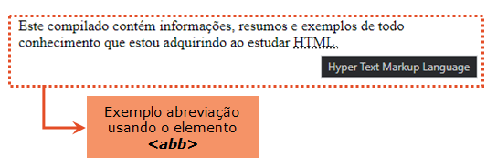


<p align = "justify">Quando estamos referenciando um trabalho como um livro, filme ou artigo de pesquisa, o elemento &lt;cite&gt; pode ser usado para indicar a origem da citação. O texto no elemento &lt;cite&gt; geralmente é renderizado em itálico. </p>

> <strong>OBSERVAÇÃO:</strong> &lt;cite&gt; não deve ser usado para o nome de uma pessoa. 


```html
<p>
    <cite>Batman Begins</cite> é o melhor filme do Batman feito até hoje.
</p>
```


<p align = "justify">O elemento &lt;address&gt; é utilizado para definir as informações de contato do autor/proprietário de um documento ou artigo. Essas informações podem ser um endereço de e-mail, URL, endereço físico, número de telefone, etc. Os navegadores geralmente mostram o conteúdo do elemento &lt;address&gt; em itálico. </p>

```html
<adress>
    Escrito por Millene Prado <br />
    <a href="mailto:">meuemail@hotmail.com</a> <br />
    Goiânia - GO
</adress>
```

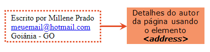

<strong>VER CÓDIGO:</strong> [exemplos elementos semânticos](https://github.com/millenevprado/html-my-notes/blob/main/exemplos/elementos-semanticos.html).

<hr>

<h1> <a name = "lists"></a>LISTAS</h1>

<p align = "justify"> A linguagem HTML disponibiliza três tipos de lista para agrupar um conjunto de itens relacionados: </p>

* listas ordenadas;
* listas não ordenadas;
* listas de definições.

## LISTAS ORDENADAS

<p align = "justify"> A lista ordenada é criada com o elemento &lt;ol&gt; (<em>ordered list</em>) e cada item desta lista é identificado com o elemento &lt;li&gt; (<em>list element</em>). Por exemplo, podemos usar o conceito de listas ordenadas para criar uma lista da ordem cronológica dos filmes da saga Harry Potter:  </p>

```html
<ol>
    <li>Harry Potter e a Pedra Filosofal</li>
    <li>Harry Potter e a Câmara Secreta </li>
    <li>Harry Potter e o Prisioneiro de Azkaban</li>
    <li>Harry Potter e o Cálice de Fogo</li>
    <li>Harry Potter e a Ordem da Fênix</li>
    <li>Harry Potter e o Enigma do Príncipe</li>
    <li>Harry Potter e as Relíquias da Morte: Parte 1</li>
    <li>Harry Potter e as Relíquias da Morte: Parte 2</li>
</ol>
```


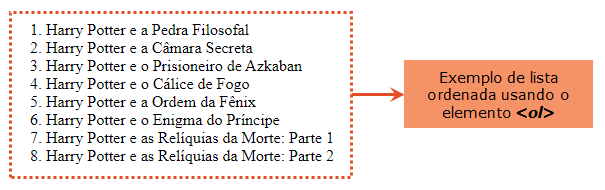


## LISTAS NÃO ORDENADAS

<p align = "justify"> A lista não ordenada é criada com o elemento &lt;ul&gt; (<em>unordered list</em>) e cada item desta lista é identificado com o elemento &lt;li&gt; (<em>list element</em>). Usamos a lista não ordenada com os itens que não apresentam uma ordem de classificação. Por exemplo, posso usar uma lista não ordenada para agrupar as principais séries da DC Comics que estão disponíveis atualmente na Netflix: </p>

```html
<ul>
    <li>The Flash</li>
    <li>Supergirl</li>
    <li>Arrow</li>
    <li>Legends of Tomorrow</li>
    <li>Titans</li>
</ul>
```


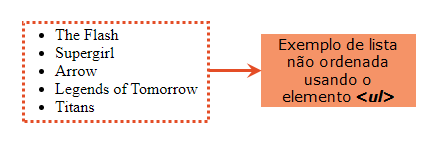


## LISTAS DE DEFINIÇÕES

<p align = "justify">Uma lista de definições consiste de uma lista de termos com suas respectivas descrições. É criada com o elemento &lt;dl&gt; (<em>definition list</em>). Cada termo (nome) é um &lt;dt&gt; (<em>definition term</em>) e cada descrição é um &lt;dd&gt; (<em>definition description</em>). Por exemplo, podemos usar uma lista de definições para descrever os principais feitiços usados na saga Harry Potter: </p>

```html
<dl>
    <dt>Accio</dt>
    <dd>Feitiço de encantamento usado para convocar objetos.</dd>
    <dt>Alohomora</dt>
    <dd>Feitiço de encantamento que serve para destrancar portas.</dd>
    <dt>Expecto Patronum</dt>
    <dd>Feitiço de encantamento que conjura um espírito protetor 
        para proteção contra criaturas das trevas./dd>   
    <dt>Petrificus Totalus</dt>
    <dd>Feitiço de maldição que petrifica o adversário.</dd>
    <dt>Wingardium Leviosa</dt>
    <dd>Feitiço de encantamento que serve para fazer objetos levitarem./dd>
</dl>
```


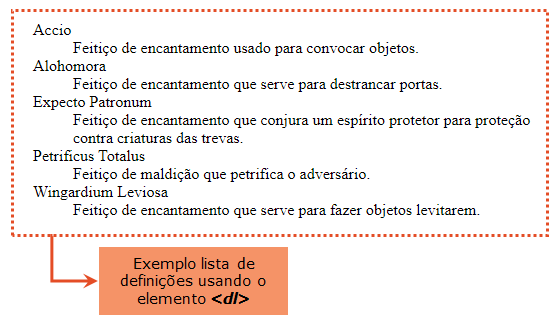

<strong>VER CÓDIGO:</strong> [exemplos listas](https://github.com/millenevprado/html-my-notes/blob/main/exemplos/listas.html).

<hr>

<h1> <a name = "links"></a>LINKS</h1>


<p align = "justify">Os links permitem que os usuários cliquem para ir de uma página para outra. Eles são criados usando o elemento &lt;a&gt; (<em>anchor</em>) e seu principal atributo, <code>href</code>, é responsável por criar a referência. O texto do link, que é a parte que fica visível para o usuário clicar é colocado entre a tag de abertura &lt;a&gt; e a tag de fechamento &lt;/a&gt;. </p>


```html
<a href="https://github.com/millenevprado">Meu perfil do GitHub</a>
```


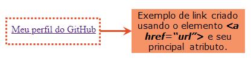

## ATRIBUTO <em>TARGET</em>

<p align = "justify">Por padrão, quando eu clicar no link, o site de destino vai abrir na mesma janela do site que continha esse link. Para alterar isso, é preciso especificar outro destino para o link, o que pode ser feito usando o atributo <code>target</code>, que possui os seguintes valores: 
<ul>
    <li><code>_blank</code>: abre o link em uma nova janela em branco </li> 
    <li><code>_self</code>: abre o link na janela ou frame atual (padrão)</li> 
    <li><code>_top</code>: abre o documento em todo o corpo da janela</li> 
    <li><code>_top</code>: abre o documento em uma referência à janela mãe</li> </ul> </p>


```html
<a href="https://github.com/millenevprado" target="_blank">Meu perfil do GitHub em uma nova janela</a>
```


## ATRIBUTO <em>REL</em>

<p align = "justify"> O atributo <code>rel</code> é usado para indicar qual é a natureza do destino do link. De acordo com o prof. <a href="https://gustavoguanabara.github.io/" >Gustavo Guanabara</a> esse atributo aceita vários valores, como por exemplo: 


<ul>
    <li><code>next</code>: indica que o link é referente a próxima parte do documento atual</li> 
    <li><code>prev</code>: indica que o link é referente a parte anterior do documento atual</li> 
    <li><code>author</code>: indica que é um link para o site do autor do artigo atual</li> 
    <li><code>external</code>: indica que é um link para outro site que não faz parte do site atual</li> 
    <li><code>notfollow</code>: indica que é um link para um site não endossado, como um link pago</li>     
</ul> 


Usando o atributo <code>rel</code> com o valor <code>next:</code>

```html
<p>
    Esta é a primeira página do site. Podemos acessar 
    também a <a href="links_pag02.html" rel="next" target="_self">segunda página</a>
</p>
```


<p align = "justify"> Neste exemplo, usamos um <strong>link interno</strong> (<code>href="links_pag02.html"</code>) que leva o usuário para outra página dentro do nosso próprio site. Um link interno é especificado com uma <strong>URL relativa</strong>, ou seja, uma URL sem a parte <code>https://www</code>. Um <strong>link externo</strong>, por usa vez, como já vimos, leva o usuário para outro site e, neste caso, usamos a <strong>URL completa</strong>, incluindo o protocolo <code>http://</code> ou <code>https://</code>. </p>


## EMAIL

<p align = "justify"> Podemos usar o valor <code>mailto:</code> dentro do atributo <code>href</code> para criar um link que abre o programa de email do usuário (para permitir que ele envie um novo e-mail): </p>

```html
<a href="mailto:meuemail@exemplo.com">Enviar email</a>
```


<strong>VER CÓDIGO:</strong> [exemplos empregando links](https://github.com/millenevprado/html-my-notes/blob/main/exemplos/links.html).

<hr>

<h1> <a name = "images"></a>IMAGENS</h1>

<p align = "justify"> Para adicionar uma imagem na página web nós empregamos o elemento <code>&lt;img&gt;</code>, que é um elemento vazio (não tem tag de fechamento). O elemento <code>&lt;img&gt;</code> tem dois atributos básicos que são requeridos:    
<ul>
    <li><code>src</code>: (<em>source</em>) especifica o caminho para a imagem.</li>
    <li><code>alt</code>: (<em>alternative</em>) especifica um texto alternativo para a imagem, que serve caso o usuário, por algum motivo, não puder visualizá-lo (devido à conexão lenta, um erro no atributo <code>src</code> ou se o usuário usar um leitor de tela).</li>
</ul>
</p>

```html
 Um leitor de tela é um programa de *software* que lê o código HTML e permite ao usuário "ouvir" o conteúdo. Os leitores de tela são úteis para pessoas com deficiência visual ou com dificuldades de aprendizagem.


## IMAGENS NA MESMA PASTA

Quando a imagem está na mesma pasta, na pasta raiz do projeto, basta colocar o nome da imagem no atributo <code>src</code>:

```html
<p>
    Esta é uma imagem do Batman que está na mesma pasta:
</p>

```

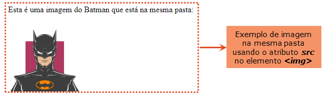


## IMAGENS EM OUTRA PASTA

Se a imagem estiver em uma subpasta é preciso incluir o nome da pasta no atributo <code>src</code>:

```html
<p>
    Esta é uma imagem do Coringa que está em uma sub-pasta chamada imagens:
</p>

```

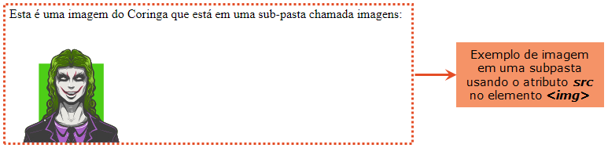


## IMAGENS EM OUTRO SERVIDOR/SITE 

Se a imagem estiver localizada em um outro domínio é preciso especificar o caminho completo (URL) da imagem no atributo <code>src</code>:

```html
<p>
    Esta é uma imagem do Batman que está no 
    <a href="https://www.dccomics.com/blog/2020/11/04/five-batman-facts-you-think-are-truebut-arent" target="_blank" rel="external">site da DC Comics</a>
</p>

```

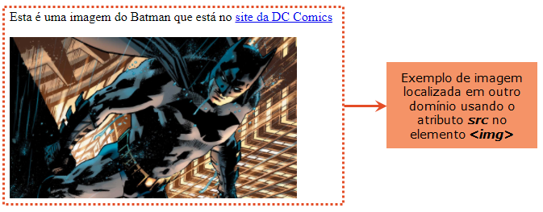

## IMAGEM COMO UM <em>LINK</em>

Podemos usar uma imagem como um <em>link</em> colocando a tag <code>img</code> dentro da tag <code>a</code>:

```html
<a href="https://github.com/millenevprado">
    
</a>
```

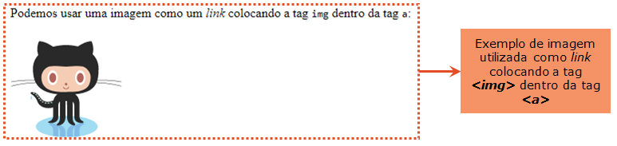

## FORMATOS DE IMAGENS

Os tipos de arquivos de imagem mais comuns, são:


| Abreviação | Formato do Arquivo                    | Extensão do Arquivo              |
| ---------- | ------------------------------------- | -------------------------------- |
| APNG       | Animated Portable Network Graphics    | .apng                            |
| GIF        | Graphics Interchange Format           | .gif                             |
| ICO        | Microsoft Icon                        | .ico, .cur                       |
| JPEG       | Joint Photographic Expert Group image | .jpg, .jpeg, .jfif, .pjpeg, .pjp |
| PNG        | Portable Network Graphics             | .png                             |
| SVG        | Scalable Vector Graphics              | .svg                             |


<strong>VER CÓDIGO:</strong> [exemplos empregando imagens](https://github.com/millenevprado/html-my-notes/blob/main/exemplos/imagens.html).

<hr>

<h1> <a name = "tables"></a>TABELAS</h1>

O elemento <code>&lt;table&gt;</code> é usado para criar tabelas. As linhas da tabela são definidas com a tag <code>&lt;tr&gt;</code> (<em>table row</em>). Os cabeçalhos da tabela são definidos empregando-se a tag <code>&lt;th&gt;</code> (<em>table heading</em>). Cada dado/célula da tabela é definido com uma tag <code>&lt;td&gt;</code> (<em>table data</em>). Por padrão, o texto do elemento <code>&lt;th&gt;</code> é negrito e centralizado e o do elemento <code>&lt;td&gt;</code>  é regular e alinhado à esquerda. 

Por exemplo, podemos criar uma tabela contendo informações sobre as casas de Hogwarts da Saga Harry Potter, como o nome de cada casa, criador da casa, animal símbolo que representa a casa e o fantasma: 


```html
<table>
    <tr>
        <th>Nome</th>
        <th>Criador</th>
        <th>Símbolo</th>
        <th>Fantasma</th>
    </tr>
    <tr>
		<td>Gryffindor</td>
		<td>Godric Gryffindor</td>
		<td>Leão</td>
		<td>Nick Quase-Sem-Cabeça</td>
    </tr>
    <tr>
        <td>Slytherin</td>
        <td>Salazar Slytherin</td>
        <td>Cobra</td>
        <td>Barão Sangrento</td>
    </tr>
    <tr>
        <td>Ravenclaw</td>
        <td>Rowena Ravenclaw</td>
        <td>Águia</td>
        <td>Helena Ravenclaw</td>
    </tr>
    <tr>
        <td>Hufflepuff</td>
        <td>Helga Hufflepuff</td>
        <td>Texugo</td>
        <td>Frei Gorducho</td>
    </tr>
</table>
```

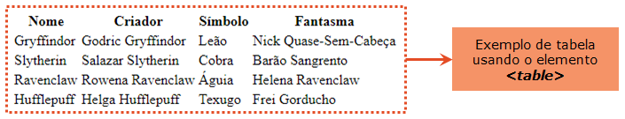

> Para formatar a tabela, como por exemplo, inserir bordas, espaçamento, alinhamento etc. empregamos as folhas de estilo (CSS).


## MESCLAR COLUNAS

Para mesclar mais de uma coluna da tabela, podemos usar o atributo <code>colspan</code>. 

Por exemplo, podemos criar uma tabela com o horário das aulas matinais da Hermione e empregar o atributo <code>colspan</code> para mesclar as disciplinas que possuem mais de um horário, como ilustrado abaixo:

```html
<table>
    <tr>
        <th></th>
		<th>09:00</th>
		<th>10:00</th>
		<th>11:00</th>
		<th>12:00</th>
	</tr>
    <tr>
		<th>Segunda-Feira</th>
		<td colspan="3">Defesa contra as artes das trevas</td>
		<td>Poções</td>
    </tr>
	<tr>
        <th>Terça-Feira</th>
 		<td>Runas antigas</td>
        <td colspan="2">Feitços</td>
        <td>Feitiços</td>
    </tr> 
    <tr>
		<th>Quarta-Feira</th>
        <td colspan="2">Herbologia</td>
        <td colspan="2">Transfiguração</td>
	</tr>
    <tr>
        <th>Quinta-Feira</th>
        <td>Duelos</td>
        <td>Poções</td>
        <td colspan="2">História da magia</td>
    </tr>
    <tr>
        <th>Sexta-Feira</th>
        <td>Feitiços</td>
        <td colspan="3">Defesa contra as artes das trevas</td>
    </tr>
</table>
```

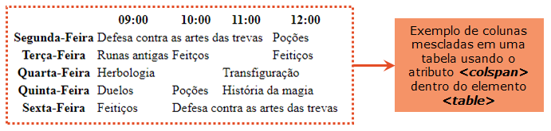

## MESCLAR LINHAS

Assim como podemos mesclar as colunas de uma tabela, nós podemos também mesclar as linhas empregando o atributo <code>rowspan</code>. 

Por exemplo, podemos criar uma tabela com as vassouras que o Harry Potter teve durante a saga e empregar o atributo  <code>rowspan</code> para mesclar as duas linhas da tabela, conforme ilsutrado abaixo:


```html
<table>
    <tr>
        <th>Personagem</th>
        <th>Harry Potter</th>
    </tr>
    <tr>
        <th rowspan="2">Vassouras</th>
        <td>Firebolt</td>
    </tr>
    <tr>
        <td>Nimbus 2000</td>
    </tr>
</table>
```

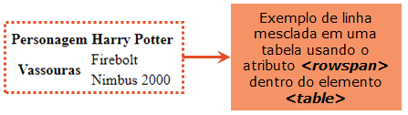

## TÍTULO DA TABELA

Para adicionar um título a tabela, podemos usar a tag <code>&lt;caption&gt;</code>, que deve ser inserida imediatamente depois da tag <code>&lt;table&gt;</code>:

```html
<table>
    <caption>Horário de Aula da Hermione</caption>
    <tr>
        <th></th>
		<th>09:00</th>
		<th>10:00</th>
		<th>11:00</th>
		<th>12:00</th>
	</tr>
    <tr>
		<th>Segunda-Feira</th>
		<td colspan="3">Defesa contra as artes das trevas</td>
		<td>Poções</td>
    </tr>
	<tr>
        <th>Terça-Feira</th>
 		<td>Runas antigas</td>
        <td colspan="2">Feitços</td>
        <td>Feitiços</td>
    </tr> 
    <tr>
		<th>Quarta-Feira</th>
        <td colspan="2">Herbologia</td>
        <td colspan="2">Transfiguração</td>
	</tr>
    <tr>
        <th>Quinta-Feira</th>
        <td>Duelos</td>
        <td>Poções</td>
        <td colspan="2">História da magia</td>
    </tr>
    <tr>
        <th>Sexta-Feira</th>
        <td>Feitiços</td>
        <td colspan="3">Defesa contra as artes das trevas</td>
    </tr>
</table>
```

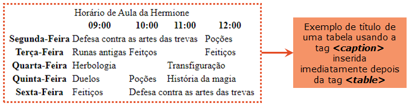

<strong>VER CÓDIGO:</strong> [exemplos empregando tabelas](https://github.com/millenevprado/html-my-notes/blob/main/exemplos/tabelas.html).

<hr>

<h1> <a name = "forms"></a>FORMULÁRIOS</h1>

Os formulários HTML fornecem um conjunto de diferentes elementos que permitem coletar informações dos usuários do site. Por exemplo, podemos coletar informações das seguintes formas:

* Adicionando texto: 
  * <em>text input</em>: usado para uma única linha de texto, como endereço de e-mail e nomes
  * <em>password input</em>: usado para coletar a senha do usuário (os caracteres ficam ocultos)
  * <em>text area</em>: usado para mensagens e comentários, por exemplo
* Selecionando opções:
  * <em>Radio buttons</em>: usado para quando o usuário deve selecionar uma entre um número de opções
  * <em>Checkboxes</em>: quando o usuário pode selecionar ou desmarcar uma ou mais opções
  * <em>Drowp-down-boxes</em>: quando o usuário deve selecionar uma entre um número de opções de uma lista
* Submetendo o formulário:
  * <em>Submit buttons</em>: para submeter dados do seu formulário para outra página da web
* Enviando arquivos:
  * <em>File upload</em>: permite que o usuário envie arquivos (como imagens, pdf etc) para o página da web


## ESTRUTURA DO FORMULÁRIO

Podemos criar um formulário usando o elemento <code>&lt;form&gt;</code>, que deve sempre ter o atributo <code>action</code>. O valor do atributo <code>action</code> é a URL da página no servidor que receberá as informações do formulário quando ele for submetido.


<h1> <a name = "references"></a>REFERÊNCIAS</h1>


## LIVROS

DUCKETT, Jon. **HTML & CSS: design and build websites**. Indianapolis, IN: Wiley, 2011.


## TUTORIAIS 

[HTML Introduction - W3Schools](https://www.w3schools.com/html/html_intro.asp)

[Introdução ao HTML - MDN Web Docs](https://developer.mozilla.org/pt-BR/docs/Learn/HTML/Introduction_to_HTML)